# BPSR: Guide compréhensif de la classe Wind Knight (spec Skyward)
(Ceci est une traduction française du guide rédigé par s.now_ (s.now25))
- [Introduction](#introduction)
- [Compétences](#compétences)
  - [Attaque de base](#attaque-de-base-(clique-gauche-de-la-souris))
  - [Skyfall](#skyfall)
  - [Typhoon Cleave](#typhoon-cleave)
  - [Falcon Toss](#falcon-toss)
  - [Instant Edge](#instant-edge)
  - [Galeform](#galeform)
  - [Sharp Impact](#sharp-impact)
- [Ressources de classe](#ressources-de-classe)
  - [Courage](#courage)
  - [Sharp](#sharp)
  - [Chasing Step](#chasing-step)
- [Buff clés](#ressources-de-classe)
  - [Wind Fury](#wind-fury)
  - [Buff Galeform](#buff-galeform)
  - [Wind and Thunder](#wind-and-thunder)
- [Arbre de compétences passives](#arbre-de-compétences-passives)
  - [Noeuds clés](#noeuds-clés)
    - [Tornade](#tornade)
    - [Instant Edge Combo](#instant-edge-combo)
    - [Azure Sever](#azure-sever)
    - [Chasing Step](#chasing-step)
    - [Sharp Impact](#sharp-impact)
    - [Wind Fury](#wind-fury)
  - [Build arbre de compétence](#build-arbre-de-compétence)
    - [Build recommandé](#build-recommandé)
    - [Autres builds](#autres-builds)
- [Rotation](#rotation)
  - [Gérer le Courage et autres nuances](#gérer-le-courage-et-autres-nuances)
- [Équipement et stats](#équipement-et-stats)
  - [Stats](#stats)
    - [Critique](#critique)
    - [Célérité (Haste)](#célérité-(haste))
    - [Chance (Luck)](#chance-(luck))
- [Imagines](#imagines)
  - [Imagines pour Whales](#imagines-pour-whales)
  - [Imagines pour F2P](#imagines-pour-f2p)
- [Modules](#modules)
- [Mises à jour](#mises-à-jour)
- [NB](#nb)

---

## Version vidéo de ce guide (en anglais)
[https://youtu.be/rotHMENL6Ek](https://youtu.be/rotHMENL6Ek)

## Introduction

Le Skyward Wind Knight est un DPS de mêlée avec une mécanique unique où vous restez en l’air la moitié du temps pendant le combat. Quand vous êtes en l’air vous pouvez éviter beaucoup de dégâts au sol (y compris les attaques de boss). La classe possède d’excellents dégâts de zone (AoE) et des dégâts monocible respectables, mais elle n’a aucune compétence d’interruption ni de regroupement de mobs.

Cette classe utilise de l’équipement basé sur la Force, le même type d’équipement que les deux classes tank. Si vous souhaitez aussi jouer tank en parallèle sans trop optimiser le tank, il vous suffira simplement de farmer une arme de tank et vous serez prêt.

Cette classe n’est pas la meilleure classe DPS. Si vous voulez jouer une classe DPS de premier plan, je vous recommande plutôt de jouer Marksman (Bow).

## Compétences

### Attaque de base (clique gauche de la souris)

- Priorité d'amélioration: pas besoin d'améliorer
- N'est jamais utilisé lors de la rotation optimisée.

### Skyfall

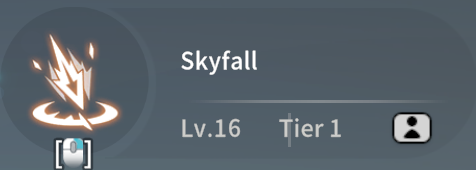

- Priorité d'amélioration: 3ème
- Compétence principale pour générer des stacks de [Sharp](#sharp) et proc Chasing Step.

### Typhoon Cleave

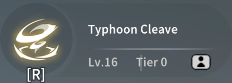

- Priorité d'amélioration: pas besoin d'améliorer
- Utilisé pour générer du [Courage](#courage), pas pour les dégâts.

### Falcon Toss

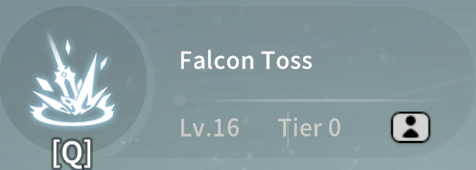

- Priorité d'amélioration: 4ème
- Généralement pas utilisé en rotation, utilisé une seule fois durant [Wind Fury](#wind-fury) quand Azure Sever est disponible.

### Instant Edge

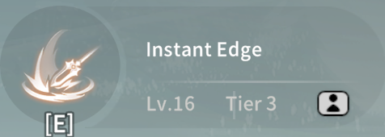

- Priorité d'amélioration: 1er
- L'une des sources principales de dégâts pour la classe, consomme des stacks de [Sharp](#sharp) à l'utilisation et consomme des stacks de Chasing Step lorsqu’un ennemi est touché.
- Permet de recharger [Sharp Impact](#sharp-impact).
- Durant [Wind Fury](#wind-fury) la compétence déclenche une tornade lorsqu'un ennemi est touché.
  - Si la compétence est utilisée en l'air, une tornade sera créée.
  - Si la compétence est utilisée au sol, deux tornades seront créées (mais l'animation sera plus longue).
- Cette compétence est utilisée pour déclencher Instant Edge Combo.

### Galeform

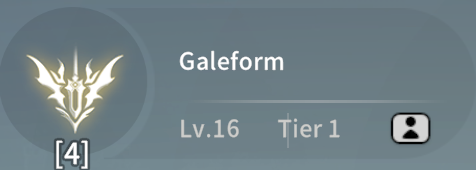

- Priorité d'amélioration: 2ème
- Utilisé pour activer le [buff Galeform](#buff-galeform), possède 2 charges avec un cooldown de 30 secondes.
- Améliorer cette compétence augmente le buff de dégâts, affectant toutes les autres compétences.

### Sharp Impact

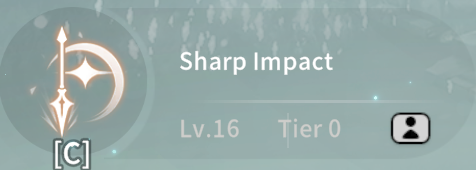

- Priorité d'amélioration: 4ème
- Les dégâts de la compétence sont négligeable, elle est utilisée surtout pour activer le buff [Wind Fury](#wind-fury).
- Quand la compétence est lancée au sol, votre personnage se téléporte d'abord au dessus de la cible avant de s'écraser au sol. Cette animation de téléportation initiale est longue mais elle peut être entièrement évitée en sautant avant de lancer la compétence. Cette technique "jump cancel" est incorporée dans la rotation.

## Ressources de classe

### Courage

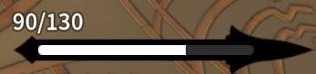

- Recharge naturellement au rythme de 3 [Courage](#courage) / seconde.
- Quand le buff [Galeform](#galeform) est actif, recharge naturellement 7 [Courage](#courage) / seconde additionnel.
- Quand le buff [Wind Fury](#wind-fury) est actif, la recharge additionnelle de [Galeform](#galeform) passe à 10 [Courage](#courage) / seconde.
- Les ticks de recharge de [Galeform](#galeform) sont indépendants des ticks de régénération naturelle.

### Sharp

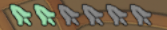

- Chaque stack dure 10 secondes, quand le timer arrive à zéro un stack est retiré. Si cela arrive, cela est considéré comme un stack dépensé pour charger [Sharp Impact](#sharp-impact).
- Chaque stack donne +5% d'attaque, n'avoir qu'un seul stack de [Sharp](#sharp) est suffisant pour donner le même bonus d'attaque que si les stacks étaient complets. Cela veut dire que (en assumant que le maximum de [Sharp](#sharp) est augmenté à 6 via les nodes passifs) n'avoir qu'un seul stack de [Sharp](#sharp) donne: 5% x 6 = 30% bonus d'attaque.
- Due à cette méchanique, il est nécessaire de toujours garder au moins un stack de [Sharp](#sharp) en tout temps. Cela vaut également pour les DoTs comme les tornades car les dégâts sont calculés pour chaque tick de dégât plutôt que snapshot à la création de la tornade en elle-même.

### Chasing Step

| 1 Stack | 2 Stacks |
|-----------|-----------|
| 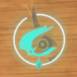  | 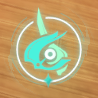  |

- Un stack de Chasing Step est généré quand [Skyfall](#skyfall) inflige des dégâts critiques, jusqu'à 2 stacks max.
- Quand un stack est dépensé par [Instant Edge](#instant-edge), il génère 1 stack de [Sharp](#sharp).
- Quand un stack est dépensé par [Instant Edge](#instant-edge), il double la charge de [Sharp Impact](#sharp-impact).
  - Une utilisation d'[Instant Edge](#instant-edge) à 3 stack de [Sharp](#sharp) charge 15% de [Sharp Impact](#sharp-impact), avec un stack de Chasing Step cela augmente à 30%.
- C'est l'une des ressources les plus importantes, permettant d'accélérer la charge de [Sharp Impact](#sharp-impact), plus de détails dans la partie Rotation.

## Buff clés

### Wind Fury

- Buff de 15 secondes déclenché par [Sharp Impact](#sharp-impact), augmente les dégâts infligés de 15%.
- Augmente la régénération de [Courage](#courage) du buff [Galeform](#galeform).
- [Falcon Toss](#falcon-toss) devient Azure Sever pour la première utilisation durant le buff.
- [Instant Edge](#instant-edge) et Azure Sever génèrent une Tornade durant le buff.
  - Si [Instant Edge](#instant-edge) est lancé en étant au sol, la compétence touche l'ennemi deux fois et crée deux Tornades

### Buff Galeform

- Buff de 15 secondes qui augmente la régénération de [Courage](#courage) et l'attaque (conversion de force), quand le buff est actif la barre de [Courage](#courage) sera entourée de vert.

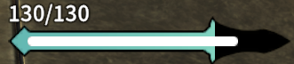

### Wind and Thunder

-Quand le [buff Galeform](#buff-galeform) se dissipe, il applique un second buff: Wind and Thunder. Le [buff Galeform](#buff-galeform) doit expirer naturellement à la fin de son timer pour déclencher ce second buff. Si le [buff Galeform](#buff-galeform) est retiré ou rafraîchit avant qu'il ne termine, Wind and Thunder ne sera pas appliqué.

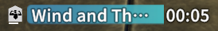

## Arbre de compétences passives

### Noeuds clés

#### Tornade

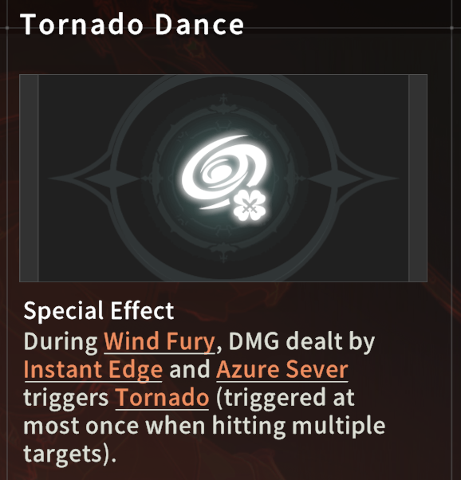
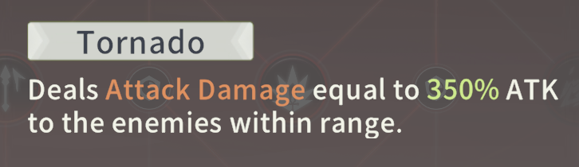

La description en jeu de la Tornade n'est pas complète. Voici en détail comment la Tornade fonctionne.
- Chaque Tornade reste sur le terrain pendant 3 secondes, délivrant 1 tick de dégât par cible par seconde. Chaque tick de dégâts est équivalent à 350% de l'attaque, cela signifie que la tornade inflige jusqu'à 1050% de multiplicateur d'attaque en dégât par cible (en assumant que tous les ticks de dégâts sont infligés à la cible).
  - Après la mise à jour d’équilibrage de classe du 28/08, les patch notes indiquent que chaque Tornade verra ses dégâts réduits de 20% après chaque coup, jusqu’à un minimum de 40% de l’attaque. Cela signifie que le multiplicateur de dégâts de chaque Tornade peut passer de 1050% à 40% s’il touche suffisamment d’ennemis (scénario non monocible).
  - Mais en réalité, ce qui est implémenté en jeu n’est pas conforme aux patch notes : la réduction appliquée par coup est en fait de 40%, et non de 20%. Nous ne savons pas encore si cela sera corrigé pour correspondre aux patch notes, ou si la description sera simplement ajustée pour refléter ce qui est réellement en jeu.
  - Il ne peut y avoir que 3 Tornades sur le terrain à la fois. Les compétences ne déclencheront pas de Tornades supplémentaires et ne rafraîchiront pas les Tornades existants lorsqu’il y en a déjà 3 en jeu.
  - Les dégâts des Tornades ne se basent ni sur le niveau des compétences, ni sur les dégâts de Mêlée, ni sur les dégâts de Skill Expertise.
  - La Tornade est l’une des principales sources de dégâts. Les compétences qui déclenchent des Tornades sont expliquées dans la section [Wind Fury](#wind-fury).

#### Instant Edge Combo

Après la mise à jour d’équilibrage de classe du 28/08, ce noeud est passé d’un taux fixe de 15% à un taux identique à celui de Lucky Hit du personnage, c’est-à-dire le pourcentage de Luck. Les dégâts seront alors calculés comme les dégâts de [Instant Edge](#instant-edge) (avec tous ses multiplicateurs applicables) × le multiplicateur de dégâts Lucky Hit. Sur mon personnage avec un set 4 pièces d’équipement de classe niveau 60 + une arme niveau 70, ce multiplicateur est d’environ 100%, ce qui signifie qu’à chaque proc, [Instant Edge](#instant-edge) inflige 2x ses dégâts.

| Avant | Après |
|-----------|-----------|
| 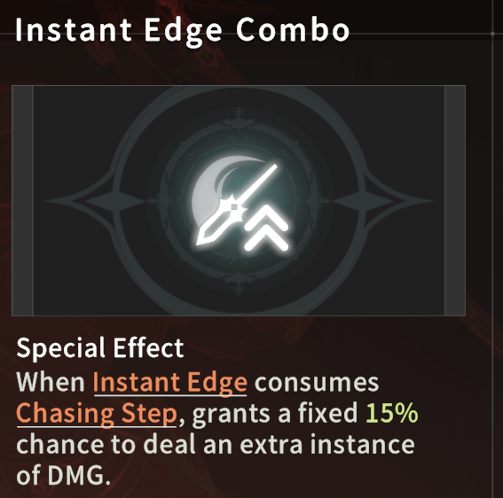  | 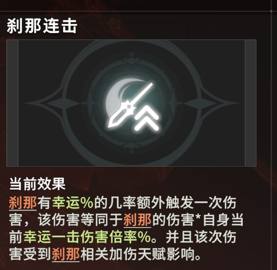  |

#### Azure Sever

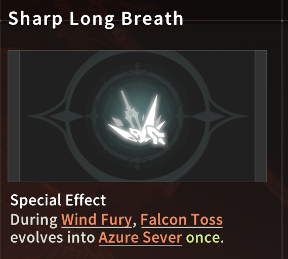

Permet d'utiliser Azure Sever, générant 3 stacks de [Sharp](#sharp) quand la compétence touche un ennemi, voir [Falcon Toss](#falcon-toss) et [Wind Fury](#wind-fury) pour plus d'infos.

#### Chasing Step

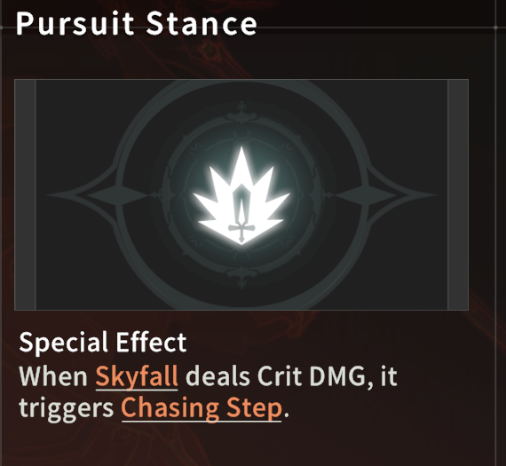

Permet d'utiliser Chasing Step.

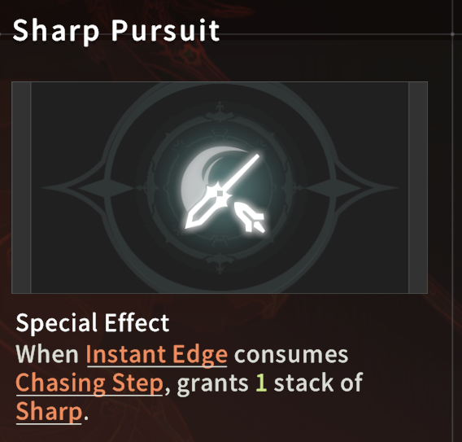

Génère 1 stack de [Sharp](#sharp) quand Chasing Step est consommé.

#### Sharp Impact

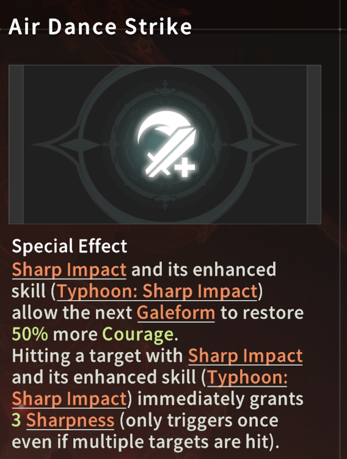

- Augmente la génération de [Courage](#courage) de [Galeform](#galeform).
- Génère 3 stacks de [Sharp](#sharp) quand [Sharp Impact](#sharp-impact) touche un ennemi

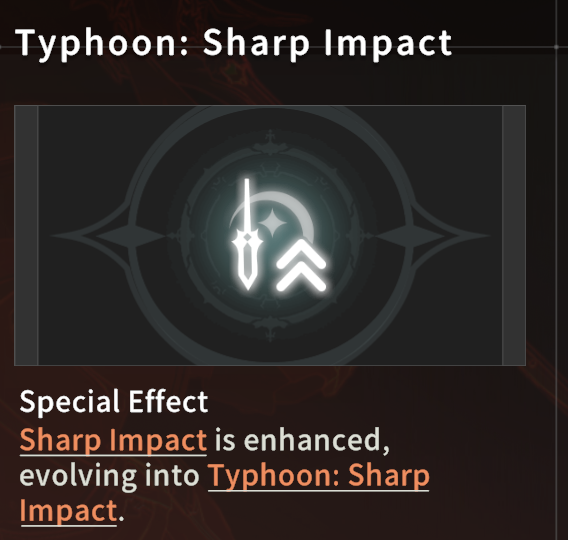

- Le jeu n’explique pas bien ce point : ce noeud fait en sorte que [Sharp Impact](#sharp-impact) inflige un coup supplémentaire, et ce coup supplémentaire accorde 3 [Sharp](#sharp) en plus des 3 obtenus via Air Dance Strike.
- L’objectif principal de prendre ce noeud est donc d’avoir directement 6 [Sharp](#sharp) après chaque [Sharp Impact](#sharp-impact).

#### Wind Fury

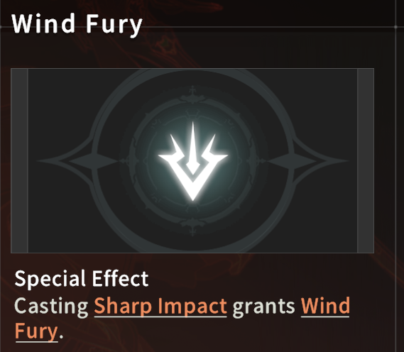

Permet de bénéficier de [Wind Fury](#wind-fury).

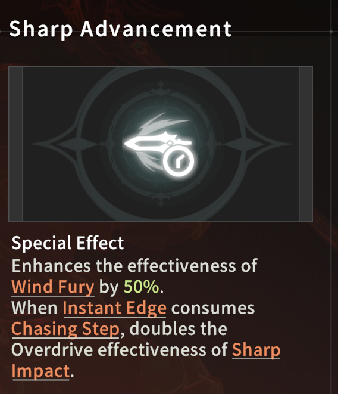

Permet de bénéficier de la double charge de [Sharp Impact](#sharp-impact) avec [Instant Edge](#instant-edge)

### Build arbre de compétence

#### Build recommandé

Le bleu met en évidence le cœur du build. Avec un équipement niveau 60 (arme 70), vous devez prendre le chemin jaune pour augmenter les dégâts des Tornades. Même si les dégâts des Tornades ont été nerfés lors de la mise à jour d’équilibrage de classe du 28/08, cela reste malgré tout la source de dégâts la plus importante.

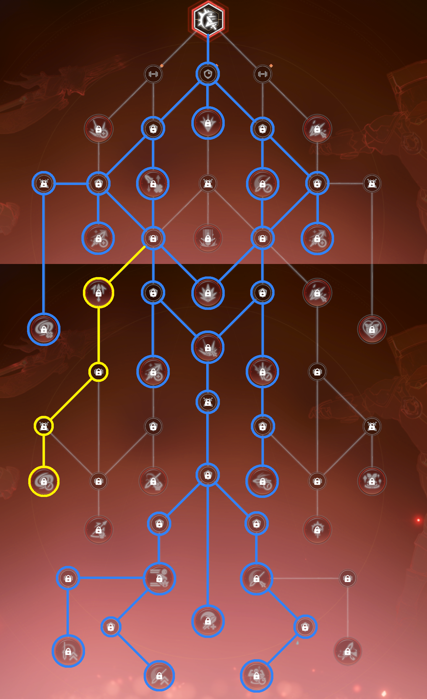

#### Autres builds

Il existe quelques builds assez originaux pour cette classe. Je ne les recommande pas ici car ces builds vont à l’encontre de l’idée que les devs ont de cette classe (vous misez sur des stats que le jeu ne conseille pas), et il faudrait investir dans d’autres Imagines (gold).

Si ces builds originaux deviennent trop puissants et attirent l’attention des devs, ils seront équilibrés et nerfés tout comme la meta Tornade. J’aimerais éviter que des joueurs viennent me dire qu’ils se sont fait arnaquer après avoir investi dans des Imagines devenus inutiles pour la classe parce qu’ils ont suivi mon guide pour un build original et que les devs l’ont nerf.

Cela étant dit, si vous êtes quand même intéressés, vous pouvez me contacter et je pourrai vous expliquer ces autres builds en privé.

## Rotation

La rotation pour le build recommandé est en réalité très simple :

1. Utilisez toutes les imagines disponibles, puis [Galeform](#galeform).
2. Faites un jump cancel pour [Sharp Impact](#sharp-impact) (note : génère 6 [Sharp](#sharp) grâce à [ce noeud](#sharp-impact-)).
3. [Instant Edge](#instant-edge) au sol, puis 3x [Skyfall](#skyfall).
4. [Instant Edge](#instant-edge) en l'air → [Instant Edge](#instant-edge) au sol.
5. Azure Sever, puis faites 1 ou 2 [Skyfall](#skyfall) jusqu’à atteindre 6 stacks de [Sharp](#sharp) (note : Azure Sever génère 3 [Sharp](#sharp), grâce à [ce noeud](#azure-sever)).
6. [Instant Edge](#instant-edge) en l'air → [Instant Edge](#instant-edge) au sol.

Tant que vous obtenez 2 procs de Chasing Step sur les 5 [Skyfall](#skyfall) des étapes 3 et 5, votre [Sharp Impact](#sharp-impact) sera rechargé à la fin de l’étape 6. Vous pourrez alors recommencer la rotation à partir de l’étape 1 ou 2. C’est pour cette raison que vous n’avez besoin que d’environ 40% de crit rate (2 / 5 = 0,4) pour exécuter cette rotation sans problème.

### Gérer le Courage et autres nuances

Il y a quelques nuances dans la gestion de [Courage](#courage), notamment concernant l’utilisation de [Galeform](#galeform) et de l’ultime ([Typhoon Cleave](#typhoon-cleave)). Tout d’abord, vous devez retenir trois chiffres : 35, 70 et 105. Ce sont les valeurs de [Courage](#courage) nécessaires pour lancer respectivement 1x, 2x et 3x [Skyfall](#skyfall).

- Supposons que vous soyez actuellement à l’étape 2 de la rotation, et que votre [Courage](#courage) soit supérieur à 105. Vous savez alors que vous pouvez continuer la rotation jusqu’à la fin de l’étape 3. Si à l’étape 3 vous obtenez deux procs de Chasing Step sur les 3x [Skyfall](#skyfall), alors vous savez qu’il ne vous restera qu’à faire 1 [Skyfall](#skyfall) à l’étape 5, soit 35 [Courage](#courage). À ce moment, vous pouvez vérifier si vous avez 35 [Courage](#courage) pendant l’exécution de l’étape 4, et décider si vous devez utiliser [Galeform](#galeform) avant l’étape 5. L’idée ici est de retarder l’utilisation de [Galeform](#galeform) suffisamment pour ne pas atteindre le maximum de [Courage](#courage). Quand vous êtes chanceux (obtenant deux procs de Chasing Step), vous pouvez généralement retarder encore plus, car vous n’avez pas besoin de faire les cinq [Skyfall](#skyfall). Quand vous êtes malchanceux (aucun proc de Chasing Step sur les cinq [Skyfall](#skyfall)), vous devrez probablement utiliser l’ult pour récupérer du [Courage](#courage) afin de ne pas briser complètement la rotation.
- À l’étape 5, vous pouvez alterner l’ordre de Azure Sever et de [Skyfall](#skyfall) en fonction de votre [Courage](#courage) et du temps restant du buff [Galeform](#galeform).
  - Si votre [Courage](#courage) est sur le point d’atteindre le cap de 130, vous devez utiliser [Skyfall](#skyfall) pour atteindre 3 [Sharp](#sharp) stacks d’abord, puis utiliser Azure Sever. Cela évite de gaspiller du [Courage](#courage).
  - Si le buff [Galeform](#galeform) est sur le point de se terminer, vous devez utiliser Azure Sever en premier afin que ses dégâts soient augmentés.
  - S’il n’y a actuellement aucun buff [Galeform](#galeform) actif et que votre [Courage](#courage) est faible, vous pouvez utiliser [Galeform](#galeform), puis Azure Sever, puis [Skyfall](#skyfall) pour remplir les [Sharp](#sharp) stacks restants. Cela garantit que les dégâts de Azure Sever sont boostés et que vous avez suffisamment de temps pour régénérer du [Courage](#courage) pour [Skyfall](#skyfall).
  - S’il y a déjà 3 Tornades sur le terrain, vous pouvez faire [Skyfall](#skyfall) > Azure Sever > [Skyfall](#skyfall) pour éviter que le Tornade d’Azure Sever ne soit pas généré à cause du cap de Tornades (expliqué dans la section Tornades).

Il existe beaucoup, beaucoup d’autres scénarios. À force de jouer, vous commencerez à ressentir ce que vous devez faire.

## Équipement et stats

### Stats

#### Critique

Il faut 40% de chance de coup critique pour pouvoir exécuter la rotation telle qu’expliquée dans la section Rotation. Une fois 40% atteint, accumuler davantage de chance de critique n’apporte pas autant de valeur que d’autres statistiques comme la célérité (haste).

#### Célérité (haste)

Le but d’accumuler de la célérité est d’obtenir une vitesse d’attaque plus élevée, chaque pourcentage de célérité nous donnant 1,6% de vitesse d’attaque.

Mais comme la conversion de la valeur brute de célérité en pourcentage subit des rendements décroissants, alors que l’augmentation du pourcentage de vitesse d’attaque est linéaire, il est toujours préférable de privilégier directement la vitesse d’attaque si possible.

Sources d’augmentation directe du pourcentage de vitesse d’attaque :
- Équipement violet
- Modules
Nous voulons atteindre au moins 20% de vitesse d’attaque, ce qui nous permettra de terminer confortablement 1 rotation pendant la durée de 15s de [Wind Fury](#wind-fury), maintenant ainsi 100% de temps actif sur [Wind Fury](#wind-fury).

Personnellement, je recommande de viser une vitesse d’attaque supérieure à 20%, car il nous arrive encore d’atteindre le cap de [Courage](#courage). Une vitesse d’attaque plus élevée permettra de convertir le [Courage](#courage) gaspillé en dégâts. Bien qu’il soit attendu qu’il existe un point où la vitesse d’attaque sera trop élevée et que la génération de ressources ne pourra pas suivre, je ne sais pas encore où se situe ce point.

Pour référence, mon personnage avec un équipement niveau 60 est à 25% de vitesse d’attaque, et avec l’équipement niveau 80 à venir, il est prévu que ce soit encore plus élevé.

#### Chance (Luck)

Avec la mise à jour d’équilibrage de classe du 28/08, la Chance va désormais scaler un peu, voir la section sur [Instant Edge](#instant-edge) Combo.

Actuellement, je n’ai pas assez de données pour dire s’il existe des breakpoints ou un sweet spot à atteindre. Pour l’instant, je recommande donc simplement de viser un set de classe 6 pièces et de ne pas chercher à augmenter la Chance de manière spécifique.

### Équipement Lv60 & Gemmes

- Obtenez un set de classe 6 pièces
- Atteignez 40% de chance de coup critique
- Atteignez 20% de vitesse d’attaque
- Placez vos gemmes et refondez votre 3ème stat secondaire sur l’équipement en fonction de la stat qui vous manque. Si vous avez déjà 40% de chance de coup critique et 20% de vitesse d’attaque, je recommande de viser la célérité pour augmenter encore la vitesse d’attaque.

### Équipement Lv80 & Gemmes

- Obtenez un set de classe 4 pièces
- A FAIRE: mettre à jour crit, vitesse d'attaque cible

## Imagines

### Imagines pour Whales

| Lv5 Muku Chief | Lv5 Goblin King |
|-----------|-----------|
| 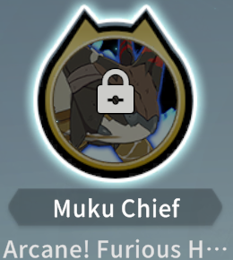  | 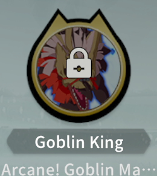  |

### Imagines pour F2P

| Lv(0-3) Muku Chief | Lv5 Muku Scout |
|-----------|-----------|
|   | 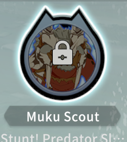  |

- Le Muku Scout surpasse largement le Storm Goblin Warrior. Tant que la rotation est correctement exécutée, le buff du Muku Scout aura un temps actif de 100%.
- La description du Muku Scout n’est pas très précise, mais en gros, il suffit d’infliger des dégâts au moins 10 fois toutes les 5 secondes pour maintenir le buff, ce qui est facilement réalisable avec mes stats et rotation recommandées.

## Modules

Ma recommandation, triée par priorité :
- Force
- Dégâts Elites
- Agilité
  - Donne des dégâts physiques fixes, de l’agilité et une augmentation des dégâts physiques. L’agilité augmente également la célérité pour cette classe.
- Vitesse d'attaque
  - Priorité plus haute si votre vitesse d’attaque est inférieure à 20%

Non recommandé :
- Chance de coup critique
  - Le module chance de coup critique vous donne des PV, et le niveau 6 apporte 12% de dégâts critique. En supposant que vous ayez Muku Chief Lv3 (19% dégâts critique) et une chance de coup critique de 45%, l’augmentation réelle de ce module serait seulement de: ((150 + 19 + 12) / (150 + 19) - 1) * 45% = 3.2%. Si votre chance de coup critique est plus bas ou le niveau de Muku Chief plus élevé, l’augmentation serait encore plus faible.

Bien que cette liste soit triée par priorité, si vous pouvez obtenir 3 modules de niveau 6 de priorité plus faible, c’est toujours mieux que d’avoir des modules de niveau 5 de haute priorité. Concentrez-vous d’abord sur l’obtention de 2 modules niveau 6, puis suivez la liste de priorité si vous pouvez choisir, et enfin visez 666 ou 665 comme objectif final.

## Mises à jour

- 02/09/25 : Mise à jour des recommandations de modules.
- 02/09/25 : Ajout d’un lien vers la version YouTube de ce guide.

## NB

Ce guide a été rédigé par Snow. Je m’efforcerai de le mettre à jour au fur et à mesure que de nouveaux contenus seront débloqués et que de nouvelles informations sur le Skyward Wind Knight seront découvertes.
